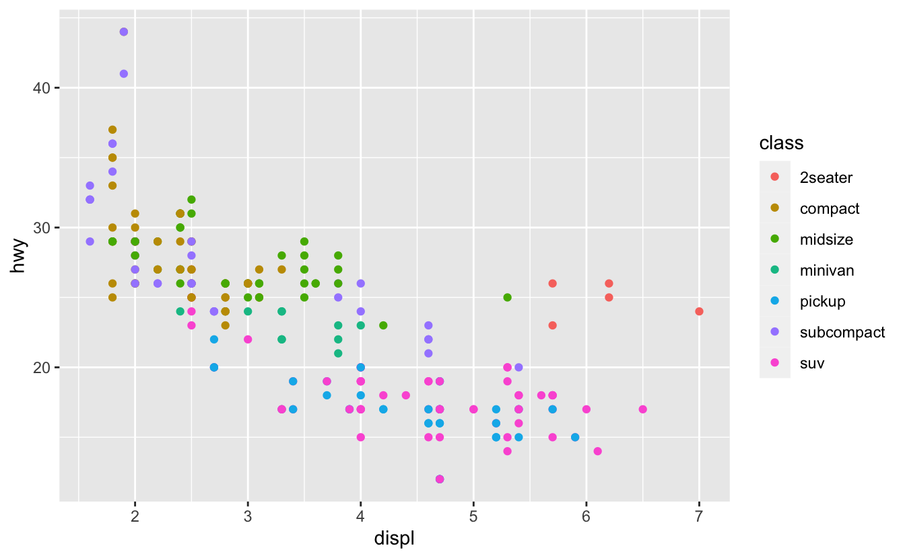

> Hadley网站上的书跟他GitHub仓库里的内容部分地方会由差异，因为作者一直在更新书籍。

------

# 1 Introduction


**Tidying**和**Transforming**合称**Wrangling**。

数据分析完成之后的**Communication**意味着分析结果不能仅仅被自己理解，更需要让他人理解。

本书所提供的内容是你在各种数据科学项目中会用的工具，大概占80%的比例，但各个项目中可能总有20%的工具是在本书之外的。


本书先从作图开始，这样子会更有趣；然后是处理数据的部分；接着是更高阶的编程部分。


本书不会处理大数据、Python/Julia、非矩形数据、假设检验等问题。


本书需要的工具是`R`、`RStuidio`、`tidyverse`以及额外的一些`R`包。

此外本书还会用到如下数据集：

```R
install.packages(c("nycflights13", "gapminder", "Lahman"))
```

> 其实整本书都是以`RStudio`、`tidyverse`生态为基础的。不过，书中也会在一些地方给出与`baseR`的对比，在对比中可以看到其相应的操作方式。


在网络上提问时，应该给他人提供最小可复现样例（**reprex**）：

1. 你使用的`Packages`；
2. 使用`dput()`函数输出一个**数据**样例；
3. 尽量保证你的**代码**具有较高的可读性。


# Explore

# 3 Data Visualization

用`ggplot2::mpg`这个数据集来展示一些基本操作。

```R
ggplot(data = <DATA>) + 
  <GEOM_FUNCTION>(mapping = aes(<MAPPINGS>))
```

`ggplot2`的图是由层构成的,`+`号就是层的一种叠加。


同一张点图，信息也可以逐步丰富的。画图，信息要浓缩在其中。

```R
ggplot(data = mpg) + 
  geom_point(mapping = aes(x = displ, y = hwy, color = class))
```


这个过程叫做**scaling**。当然scaling的方法多种多样。


`ggplot2`的帮助：https://ggplot2.tidyverse.org/

`ggplot2`的扩展：https://exts.ggplot2.tidyverse.org/gallery/

`ggplot2`的cheatsheet：https://www.rstudio.com/resources/cheatsheets/


关于数据 **mapping**，你既可以写在`ggplot()`里面，这代表着是**全局**的，也可以写在`geom_function()`里面，这表示是**局部**的。


`ggplot2`里提供了大约20种统计值（参见`?stat_bin`）。


`group`需要多多注意：https://ggplot2.tidyverse.org/reference/aes_group_order.html

hist、bar、line之类的图中经常用到，如果不加该参数可能会使图像出错。


`position` 有三个值：`"identity"`, `"dodge"` or `"fill"`。而关于位置调整的参数，可见下述：`?position_dodge`, `?position_fill`, `?position_identity`, `?position_jitter`, and `?position_stack`。


坐标系是较为复杂的部分，`coord_flip()` 可以调换x轴和y轴；`coord_polar()` 可以调用极坐标系；`coord_quickmap()` 则针对地图


总的来说，作图的图层如下：

```R
ggplot(data = <DATA>) + 
  <GEOM_FUNCTION>(
     mapping = aes(<MAPPINGS>),
     stat = <STAT>, 
     position = <POSITION>
  ) +
  <COORDINATE_FUNCTION> +
  <FACET_FUNCTION>
```

除了data、geom_function、mapping之外，其他都带有默认值。


在作图中，需要注意的方面包括：

1. `ggplot()`构造出画布
2. Aesthetic mapping，`aes(<MAPPINGS>)`添加对象和colour、size、shape属性
3. `facets`，安排图像的呈现
4. `geom_XXX()`构造不同对象的几何图形
5. 有些图其实在绘制的过程进行了一些**统计**（stat），例如`bar`；**stat** 和 **geom**有一定的对应的关系，两者可以呼唤，例如`stat_count()`和`geom_bar()`
6. Position的调整会改变出图的形式，比如是堆叠在一起，还是分别呈现
7. 坐标系，一般都是使用笛卡尔坐标系，但涉及到地图类型的就会更复杂


# 4 Workflow: basics

`<-`符号不应图省事改用`=`，会有混淆的地方。在R Studio里面使用`Alt+-`可以快捷输入。

作者推荐`this_is_a_name`这种命名方式，同时命名不要偷懒，写得清楚一些比较好。`TAB`可以自动补全，而`Ctrl+↑`则可以选择同样开头的变量。

把赋值的语句用括号括起来，会直接打印出来：`(y=seq(1,10))`。

> 这在对数据进行观察交互的时候很有用，但不应该在文件中使用。

`Alt + Shift + K`在R Studio中会给出大部分的快捷键。

# 5 Data Transformation

> 这一章作者在进行重构。——2021-7-14

`dplyr`基本的函数如下：

1. 对行操作：`filter()`、`slice()`、`arrange()`
2. 对列操作：`select()`、`mutate()`、`rename()`、`relocate()`
3. 对组操作：`summarise()`、`group_by()`

> 使用的时候需要注意，这些函数并不会对原始数据进行更改，而是生成一个新的data frame。所以如果要保存操作的结果，需要对其进行赋值，如下所示。
>
> ```R
> jan1 <- filter(flights, month == 1, day == 1)
> ```

在对数据进行比较中，特别需要注意`浮点数`。作者推荐使用`near()`，而不是`==`，以避免出现问题。

下图给出了各种逻辑运算符：

取多个豁然值的时候，一个快速的方法是`%in%`: `filter(df, x %in% c(a, b, c))` ，下面两条表述等价：

```R
month == 11 | month == 12
month %in% c(11, 12)
```

除此之外，使用[德摩根定律](https://zh.wikipedia.org/wiki/%E5%BE%B7%E6%91%A9%E6%A0%B9%E5%AE%9A%E5%BE%8B)来简化复杂的命题逻辑，也是非常有效的。

运算中涉及到`NA`的时候一定要注意`NaN`的可能性。

用`arrange()`排序的时候，`NA`总是排在最后的。

写`select()`的参数是一个技术活：

-   `starts_with("abc")`
-   `ends_with("xyz")`
-   `contains("ijk")`
-   `num_range("x", 1:3)`: 匹配 `x1`, `x2` 和 `x3`
-   `matches("(.)\\1")`：正则表达式
-   `everything()`
-   ……

和其他方法不同，`mutate()`不需要赋值操作也会对原始数据进行更改。同时注意其与`transmute()`的区别。

[%/%](https://rdrr.io/r/base/Arithmetic.html)整除，[%%](https://rdrr.io/r/base/Arithmetic.html)模除（余数）。`mutate()`的计算中有非常多计算方法，按需从帮助文件里选用吧。

三角函数参见`?Trig`的帮助文档。

`summarise()` 一般来说会跟 `group_by()`一起使用。

同时因为中间步骤愈发增多，函数嵌套的情况下引入管道操作符（pipe）：`%>%`。示意如下：`x %>% f(y)` 代表着 `f(x, y)`, 然后 `x %>% f(y) %>% g(z)` 代表着 `g(f(x, y), z)` ，然后可以不断嵌套下去。 

在数据聚合的时候，注意使用`n()`来计算样本量，或是使用`sum(!is.na(x))`来计算非空样本量。

>  http://varianceexplained.org/r/empirical_bayes_baseball/ 
>
>  http://www.evanmiller.org/how-not-to-sort-by-average-rating.html.
>
> 这一节里面所提到两个链接非常有阅读和参考的价值。主要是关于贝叶斯估计的想法。

此外，书中还列出了一系列有用的统计函数：

- `mean(x)`、`median(x)`
-  `sd(x)`、 `IQR(x)`、 `mad(x)`
-  `min(x)`、`quantile(x, 0.25)`、 `max(x)`
-  `first(x)`、 `nth(x, 2)`, 、`last(x)`
- `n()`、 `sum(!is.na(x))`、 `n_distinct(x)`

> `range()`会返回对象的最大值和最小值。
>
> 此外，用`sum()`来计数，需要输入一个逻辑参数，它会对TRUE进行计数。

`grouping()`分层多的时候，`summarise()`会根据最小的分组单元进行计算。
